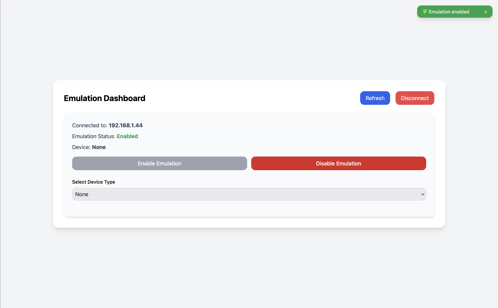
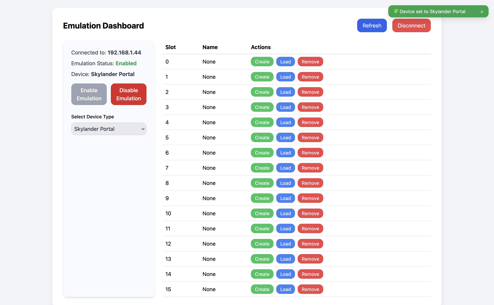
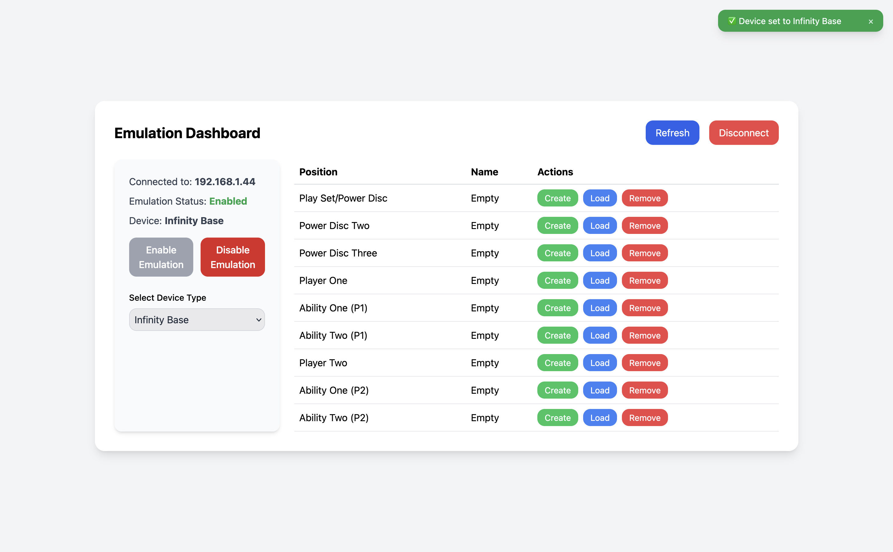
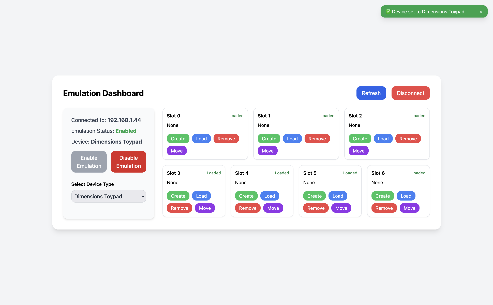
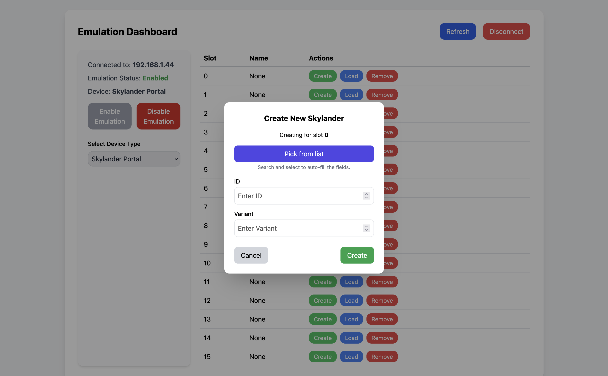
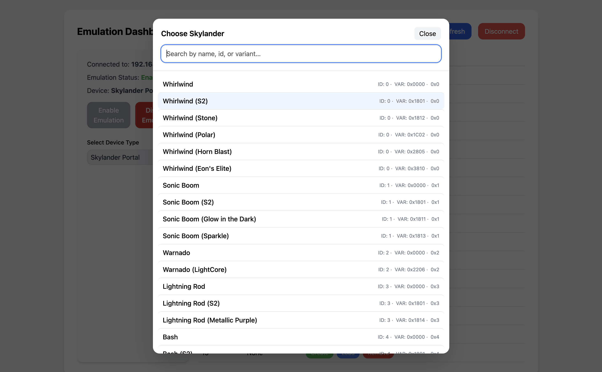
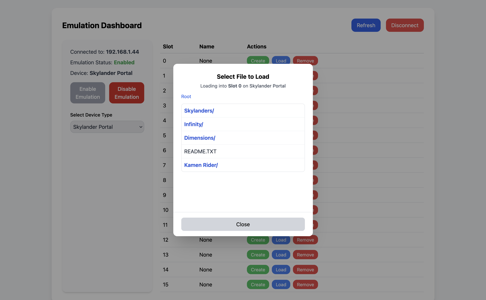
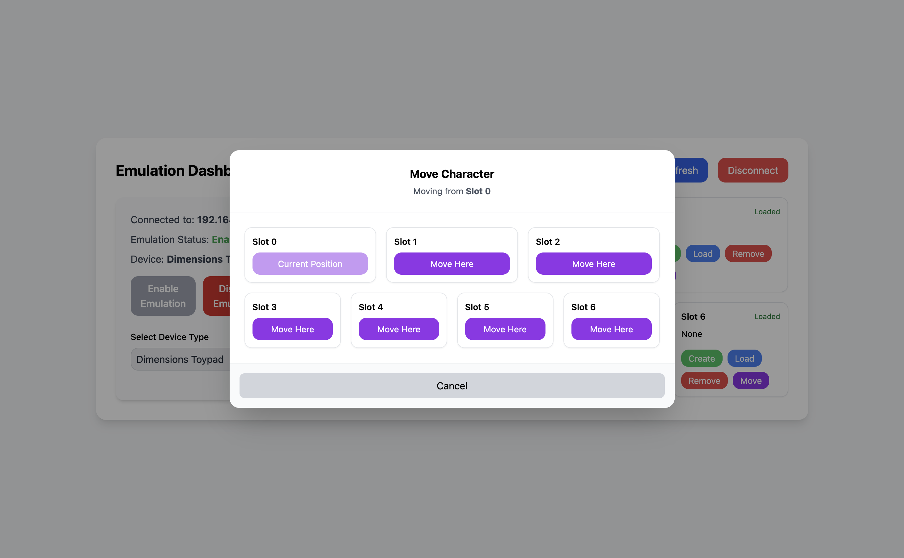

# re_nsyshid Dashboard — Vite Quickstart + Usage Guide

This guide explains how to run this web dashboard **with Vite** and how to use the UI.

---

## 1) Prerequisites

- Node.js 18+ (or 20+)
- npm / yarn / pnpm
- Your re_nsyshid backend running locally
- This project locally checked out with git:

```console
  git clone https://github.com/deReeperJosh/re_nsyshid.git
  cd re_nsyshid/webpage
```

---

## 2) Project Setup (Vite)

1. **Install dependencies**

   ```bash
   npm install
   # or: yarn / pnpm install
   ```

2. **Start Vite dev server**

   ```bash
   npm run dev
   ```

3. **Open in browser**
   - Vite defaults to `http://localhost:5173`

4. **Set the device IP the app should talk to**
   - In your browser devtools console:

     ```js
     localStorage.setItem("deviceIp", "127.0.0.1");
     location.reload();
     ```

   - Replace with your backend LAN IP if needed (e.g., `"192.168.1.23"`).

---

## 3) Using the Dashboard



### A. Top Bar

- **Refresh** — re-fetch status & device data.
- **Disconnect** — clears the saved IP and returns to the connect screen (or simply removes it from localStorage).

### B. Status & Device Controls

- **Enable/Disable Emulation** — one-click toggle.
- **Select Device Type** — choose between:
  - **Skylander**
  - **Infinity**
  - **Dimensions**

### C. Device Panels

Depending on the selected device, the right pane renders a tailored view:

- **Skylander** — table of slots with Name + Actions (Create / Load / Remove).



- **Infinity** — table of slots using slot labels (e.g., *Player One*, *Ability One (P1)*)  + Actions (Create / Load / Remove).



- **Dimensions** — a two-row grid:
  - Row 1: slots **0, 1, 2**
  - Row 2: slots **3, 4, 5, 6**
  - Each cell has **Create / Load / Remove**, plus a **Move** button.



---

## 4) Creating Figures / Tags (All Devices)



This requires having at least the following folder structure on your Wii U SD Card:

```
SD
└───wiiu
    └───re_nsyshid
            └───--Skylanders
            └───--Infinity
            └───--Dimensions
```

Figures will be created in this folder, depending on which type of figure you create.

Click **Create** in any slot to open the create modal.

### A. Searchable “Pick from list”

- Press **Pick from list** to open a searchable picker.
- Works for **Skylander, Infinity, Dimensions**.
- Type to filter by name, ID, or hex (Skylander also supports Variant hex).
- Select an item to **auto-fill** the fields:
  - Skylander → fills **ID** and **Variant**.
  - Infinity → fills **ID** only.
  - Dimensions → fills **ID** only.



### B. Manual Entry

- You can still type values directly into the inputs.
- Validation rules are applied before submission.

### C. Create

- Click **Create** to generate the file and automatically **load** it into the active slot.

---

## 5) File Browser

From the Create/Load flows, choose **Load** to open the file browser:

- Navigate directories (folders end with `/`).
- Click a file to load it into the selected slot.



> Tip: Use the breadcrumb at the top of the modal to jump around quickly.

---

## 6) Dimensions: Moving Characters



- Click **Move** on any Dimensions slot to open the **Move Character** modal.
- The modal mirrors the Toypad layout (0–2 on top; 3–6 on bottom).
- Click **Move Here** on the destination to complete the move.

---
